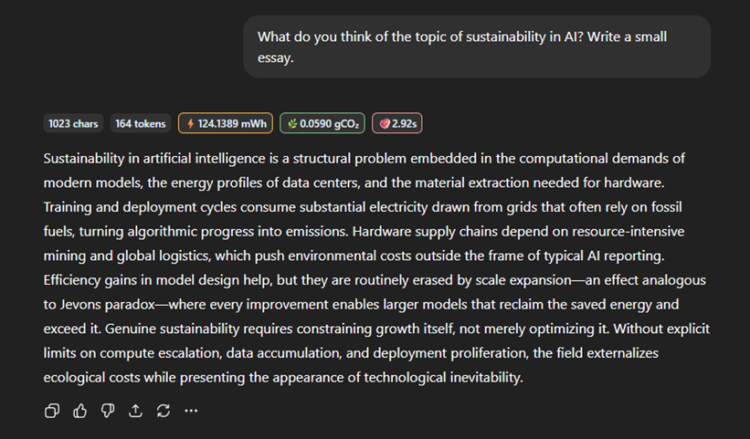

# GPT Green Tracker

**GPT Green Tracker** is a browser extension that helps you monitor the environmental impact of your AI usage. It calculates the energy consumption and carbon footprint for each AI-generated response and image generation. The extension provides insightful metrics and allows you to customize energy models and data center efficiency settings to reflect real-world usage.

## Features

- **Energy Consumption (mWh):** Displays the energy consumed for each AI-generated response.
- **CO₂ Emissions (gCO₂):** Calculates the carbon footprint based on energy usage.
- **Grilling Time Equivalent:** Shows how long you could run an electric grill with the same energy.
- **Image Generation Tracking:** Monitors energy consumption and CO₂ emissions for AI-generated images.
- **Customizable Energy Models:** Select from various energy efficiency models (e.g., GPT-3, GPT-4o, LLaMA) to adjust the energy consumption calculations.
- **PUE Adjustment:** Includes a Power Usage Effectiveness (PUE) picker to account for data center efficiency.
- **Dynamic Badges:** Adds badges to each AI response bubble and generated image with detailed metrics.

## Installation

1. **Clone or Download the Repository:**
   - Clone the repository or download the ZIP file and extract it.

2. **Load the Extension in Chrome:**
   - Open Chrome and navigate to `chrome://extensions/`.
   - Enable **Developer Mode** (toggle in the top-right corner).
   - Click **Load unpacked** and select the folder where you cloned or extracted the repository.

3. **Reload the Extension:**
   - After making any changes, reload the extension from the `chrome://extensions/` page.

## Usage

1. **Open ChatGPT:**
   - Navigate to [ChatGPT](https://chat.openai.com/) or any supported AI platform.

2. **View Metrics:**
   - For each AI-generated response, the extension will display badges with the following metrics:
     - **Character Count**
     - **Token Count**
     - **Energy Consumption (mWh)**
     - **CO₂ Emissions (gCO₂)**
     - **Grilling Time Equivalent**
   
   - For each AI-generated image, the extension will display badges with:
     - **Image Dimensions (width × height)**
     - **Token Count** (based on GPT-Image-1 estimation)
     - **Energy Consumption (mWh)**
     - **CO₂ Emissions (gCO₂)**
     - **Grilling Time Equivalent**

3. **Customize Settings:**
   - Use the **Model Picker** to select an energy model that matches your hardware setup.
   - Adjust the **PUE Picker** to reflect the efficiency of your data center.

## Customization

### Energy Models
The extension includes several predefined energy models, such as:
- GPT-3 (175B dense)
- GPT-4o (likely MoE)
- LLaMA-65B
- Llama3-70B (AWS p5)

You can select the model that best matches your usage to adjust the energy consumption calculations.

### Power Usage Effectiveness (PUE)
The PUE Picker allows you to adjust the PUE value, which accounts for the efficiency of the data center infrastructure.

## Contributing

We welcome contributions to improve the extension! To contribute:
1. Fork the repository.
2. Create a new branch for your feature or bug fix.
3. Submit a pull request with a detailed description of your changes.

## Acknowledgments

- **Energy Model Data:** Derived from various research papers and benchmarks, including Li et al. (2023), Samsi et al. (2023), and Salathé (2025).
- **Grilling Time Comparison:** Inspired by the Wall Street Journal's video, ["How Many Steaks Can One AI Video vs. AI Image Cook?"](https://www.wsj.com/tech/ai/ai-prompt-video-energy-electricity-use-046766d6).
- **Image Token Estimation:** Based on GPT-Image-1 documentation
